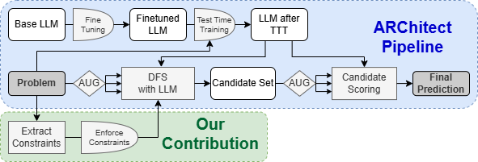

<h1 align="center">
    Combining Symbolic Constraints and Large Language Models 
    for the Abstraction and Reasoning Corpus
</h1>

  

This repository contains the reference implementation for the paper:

**Combining Symbolic Constraints and Large Language Models:  
An Application to the Abstraction and Reasoning Corpus (ARC)**

We extend the ARChitect pipeline by integrating lightweight symbolic constraints
into LLM-guided depth-first search. These constraints are inferred from the
training examples of each ARC task and enforced during decoding via backtracking,
resulting in improved accuracy and reduced inference time across multiple models.

## Relation to ARChitect

This repository is based on the **ARChitect** framework (https://github.com/da-fr/Product-of-Experts-ARC-Paper) introduced in:

> *Product of Experts with LLMs: Boosting Performance on ARC Is a Matter of Perspective*  
> Franzen et al., ICML 2025

The original ARChitect codebase provides:
- LLM fine-tuning on RE-ARC
- Augmentation-based depth-first search for candidate generation
- Product-of-Experts scoring across augmentations

This repository **forks ARChitect** and extends it with symbolic reasoning
components introduced in our paper.

## Extensions Introduced in This Repository

Compared to the original ARChitect implementation, this repository adds:

- **Symbolic constraints for ARC**
  - Implemented in `symbolic_constraints.py`
  - Constraints are inferred from training examples and checked during decoding
  - Includes histogram, counting, color-preservation, and symmetry constraints

- **Constraint-aware backtracking search**
  - Integrated directly into `inference_tools.py`
  - Partial generations are pruned as soon as a constraint is violated
  - Reduces both runtime and false positives

- **Support for the R1 (DeepSeek-R1-Distill) model**
  - Training and inference scripts added
  - Evaluated consistently with other ARChitect-compatible models

These changes implement a lightweight **neurosymbolic extension** of ARChitect,
combining LLM-guided search with symbolic pruning.

Please ensure the unsloth package is installed before running our training code.

## Files 

Here is a rough overview of our files and classes: 

#### `arc_loader.py` 
- **Purpose**: Handles all Data formatting and loading 
- **Capabilities**: 
  - Class ArcDataset which handles all data set related tasks, e.g.: 
  - Building datasets from various sources. 
  - Modifying, shuffling, and augmenting examples. 
  - Splitting, sorting, and filtering examples. 
  - Handling dataset keys, challenges and solutions. 
  - Preparing the data for tokenization. 
  - Creating and verifying submissions. 

#### `model_tools.py` 
- **Purpose**: Contains code for loading, saving and manipulating models 
- **Capabilities**: 
  - Load and Save Model and LoRA adapters 
  - Shrink Tokenizer and Embedding Layers 
  - Data Collator for masking the task inputs and the first output 
 
#### `selection.py` 
 - **Purpose**: Contains functions used to select best answer from different Candidates 
 - **Capabilities**: 
  - Various score aggregation methods 
  - Sorting candidates by their score for later submission generation 
  - Class EvalTool for doing above tasks on-the-fly and printing results 
 
 #### `finetuning_[model].py`
 - **Purpose**: Run the initial finetuning process. 
 - **Required packages**: unsloth 
 - **Steps**: 
    - Load the base model and reduce embedding size. 
    - Load and augment training data. 
    - Create a lora adapter and execute training. 
    - Save the trained lora adapter. 
    - Merge the lora model into the base model and save as final model. 
 
#### `evaluation_[model].py` 
 - **Purpose**: Run inference 
 - **Required packages**: unsloth and diskcache 
 - **Steps**:
    - Load the finetuned model. 
    - Run additional finetuning and inference for each task. 
    - Write the submission.json and results.pickle.bz2 file. 
    - Reload and verify the submission file.

#### `inference_tools.py`
- **Purpose**: Inference, scoring, and search
- **Capabilities**:
   - Depth-first search (DFS) candidate generation
   - **Constraint-aware backtracking search**
   - Integration of symbolic constraints during decoding
   - Probability-based pruning and scoring

#### `symbolic_constraints.py`
- **Purpose**: Definition and evaluation of symbolic constraints for ARC
- **Capabilities**:
   - Constraint inference from training examples
   - Online and offline constraint checking
   - Early pruning of invalid partial solutions

#### `finetuning_R1.py` / `evaluation_R1_*.py`
- **Purpose**: Training and evaluation of the DeepSeek-R1 model
- **Notes**:
   - Fully compatible with constraint-based inference
   - Used in the experiments reported in the paper
